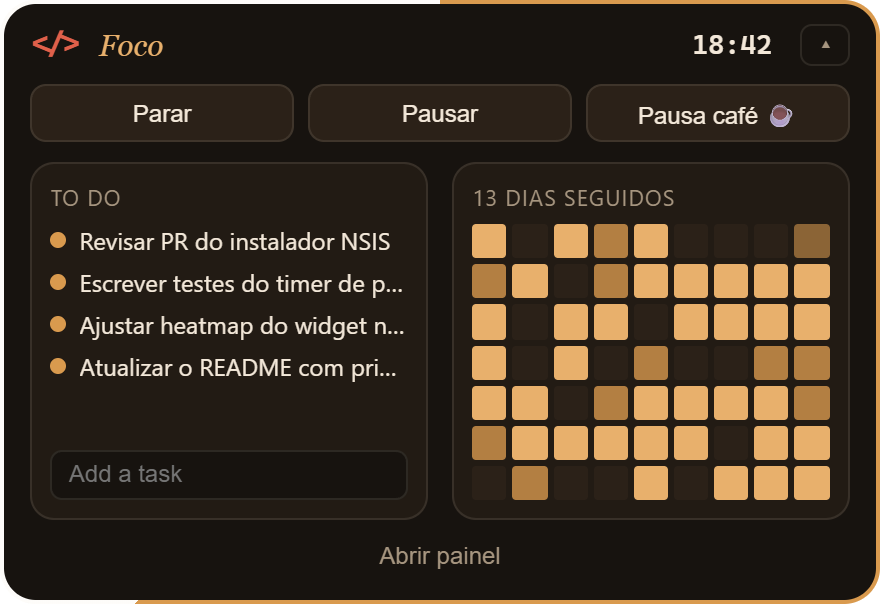
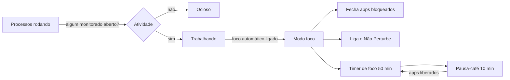
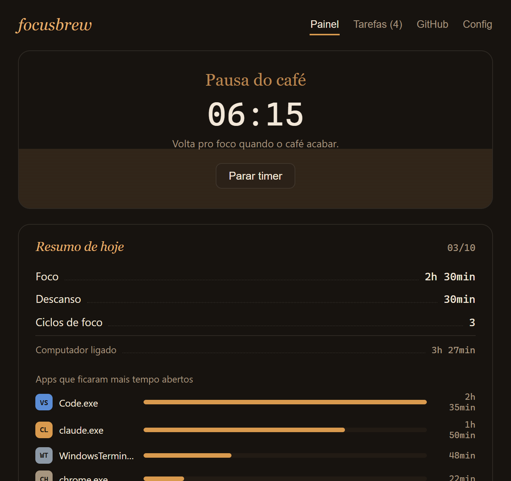
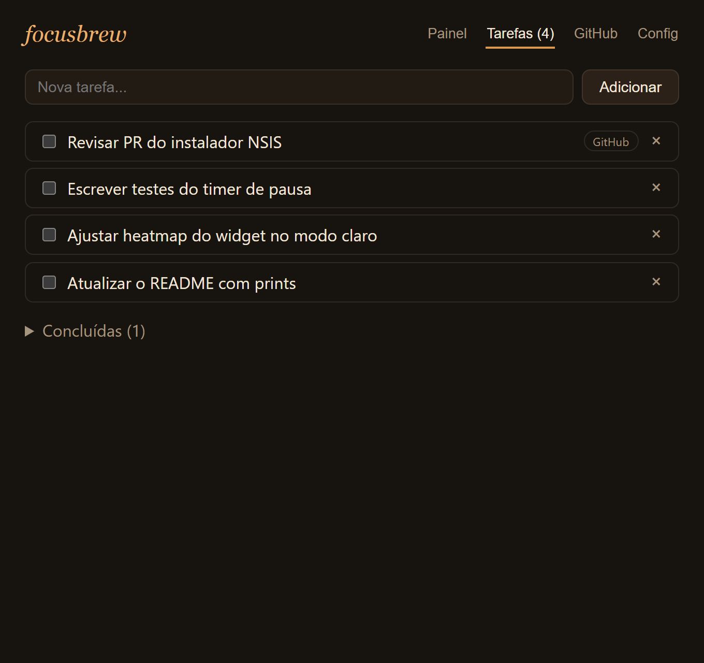
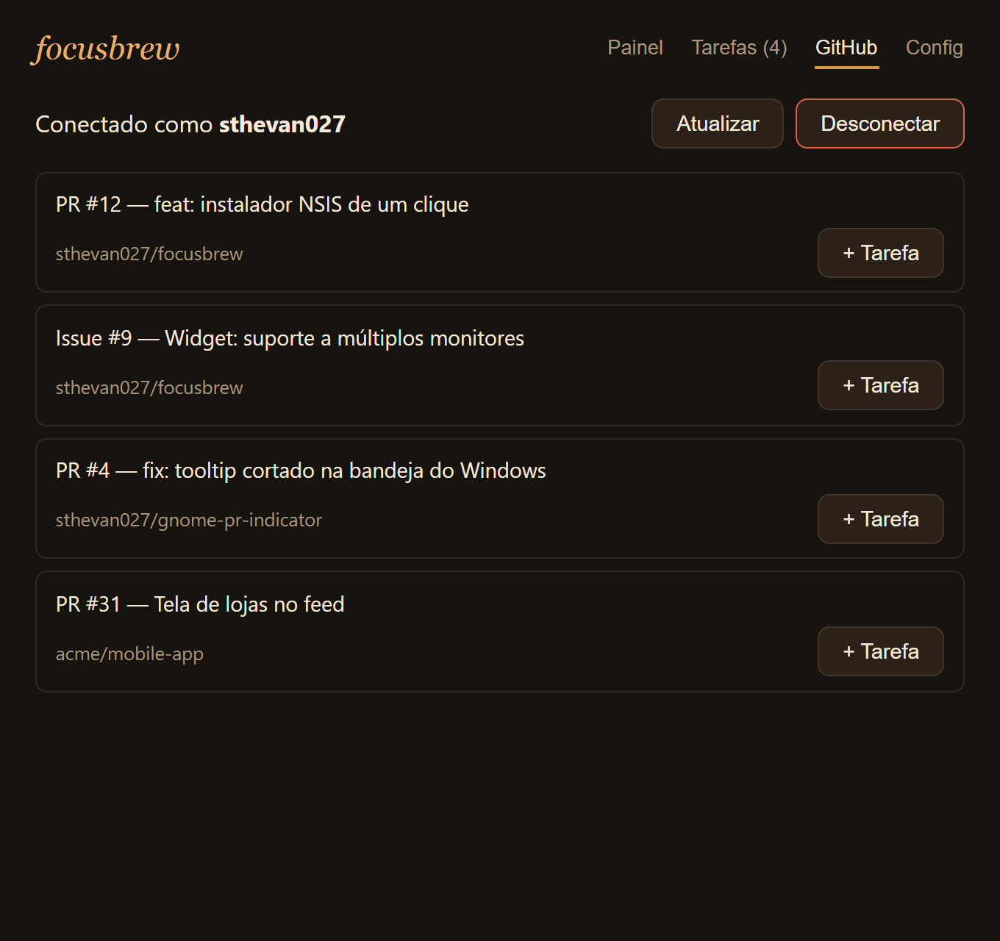
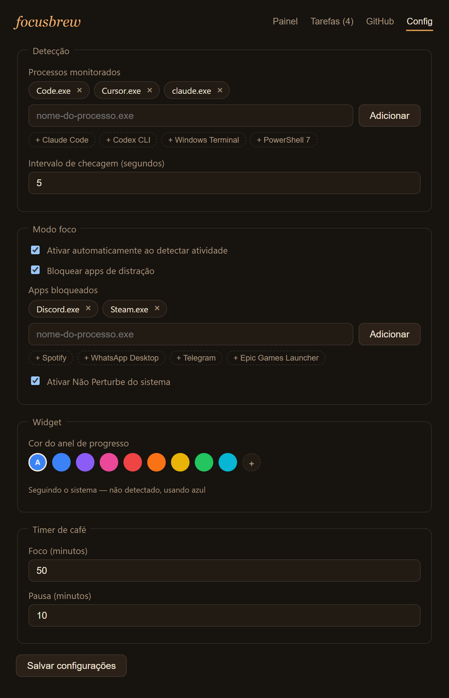

# focusbrew

App de bandeja (tray) open source que percebe quando você está trabalhando com
IA/editor de código, ativa um modo foco (bloqueia distrações, liga o Não
Perturbe) e te dá um painel com tarefas, PRs/issues do GitHub e um timer
estilo Pomodoro com pausa-café.

Feito com [Tauri](https://tauri.app) (Rust) + React/TypeScript — nativo,
leve, multiplataforma.

<p align="center">
  
</p>
<p align="center">
  
</p>

> Os prints usam dados de demonstração.

## Sumário

- [Como funciona](#como-funciona)
- [Telas](#telas)
- [Funcionalidades](#funcionalidades)
- [Instalação](#instalação)
- [Rodando localmente](#rodando-localmente)
- [Configuração](#configuração)
- [Limitações conhecidas](#limitações-conhecidas)
- [Melhorias futuras](#melhorias-futuras)

## Como funciona

O focusbrew fica rodando na bandeja e checa, a cada intervalo configurado
(padrão: 1 segundo), quais processos da sua lista de **processos
monitorados** estão abertos (por padrão VS Code, Cursor e Claude Code).



1. **Detecção.** Se um processo monitorado está aberto, o estado vira
   *trabalhando*. O ícone da bandeja e o widget mudam junto.
2. **Modo foco.** Com "Ativar automaticamente" ligado, o modo foco entra
   sozinho. Ele fecha os apps da lista de **apps bloqueados** (Discord,
   Steam…) e liga o Não Perturbe do sistema no modo *Prioritário*.
3. **Timer.** O ciclo é foco → pausa-café (padrão 50/10 min). Na pausa o
   bloqueio de apps é suspenso, então dá pra abrir o que quiser. O Não
   Perturbe fica ligado durante a sessão inteira e só desliga quando ela
   acaba.
4. **Histórico.** Cada bloco de foco/pausa é gravado, inclusive quando você
   para no meio ou fecha o app. Os blocos alimentam o "Resumo de hoje", o
   tempo por app e o streak de dias seguidos.
5. **Atalho global.** `Ctrl+Shift+Space` liga/desliga a sessão de foco de
   qualquer lugar.

Fechar o painel só esconde a janela; o app continua na bandeja. Para sair
de verdade, use **Sair** no menu da bandeja. Clicar com o botão esquerdo no
ícone abre o painel; o botão direito mostra o menu (abrir painel,
mostrar/ocultar widget, pausa-café, iniciar/parar foco, pausar detecção).

## Telas

### Painel

Status atual com o timer, resumo do dia (foco, descanso, ciclos, tempo de
computador ligado, apps mais usados) e o card do GitHub com o heatmap de
contribuições.

<p align="center">
  
  
</p>

### Widget

Uma pílula fixa no topo-centro da tela, sempre visível. Colapsada, mostra o
estado (`</>` foco, ☕ pausa), o tempo restante, a próxima tarefa e um anel
de progresso da fase atual. Clicando, expande com os controles, a lista de
tarefas e o streak.

<p align="center">
  
  &nbsp;
  
</p>

### Tarefas, GitHub e Config

<p align="center">
  
  
  
</p>

## Funcionalidades

- **Detecção de atividade**: monitora processos conhecidos (VS Code, Claude
  Code, Cursor — configurável) e muda o ícone da bandeja entre
  idle / trabalhando / foco / pausa-café.
- **Modo foco**: ao detectar atividade, opcionalmente bloqueia apps de
  distração (fecha processos de uma lista configurável) e ativa o Não
  Perturbe do sistema. Notifica quando liga/desliga.
- **Timer de café**: ciclos de foco/pausa configuráveis (padrão 50/10min),
  ícone da bandeja vira uma xícara durante a pausa e o bloqueio de apps é
  suspenso nesse período. Dá pra pausar o timer sem encerrar a sessão
  (congela a contagem, retoma de onde parou).
- **Resumo do dia**: tempo de foco e descanso, ciclos completos, tempo de
  computador ligado e quanto tempo cada app monitorado ficou aberto.
- **Widget flutuante**: janela estilo "notch", fixa no topo-centro da tela,
  sempre visível. Colapsada mostra só ícone de status + timer; ao clicar,
  expande num painel com controles rápidos, anel de progresso da sessão
  atual (cor customizável ou seguindo o accent color do sistema) e o
  heatmap de streak.
- **Atalho global**: `Ctrl+Shift+Space` liga/desliga o modo foco de
  qualquer lugar, sem precisar focar a janela.
- **GitHub**: conecta via Personal Access Token (guardado no cofre de
  credenciais do SO, nunca em texto plano) e lista PRs/issues abertos onde
  você está envolvido. Dá pra importar qualquer item como tarefa. O painel
  e o widget também puxam sua contribution calendar real (via GraphQL) pra
  mostrar streak e heatmap.
- **Quadro de tarefas**: checklist simples e local, persistido em disco. A
  primeira tarefa pendente aparece no widget durante o foco.

## Instalação

Baixe o instalador mais recente em
[Releases](https://github.com/sthevan027/focusbrew/releases)
(`focusbrew_<versão>_x64-setup.exe`).

O instalador é de **um clique**: instala só pro usuário atual (sem pedir
admin), sem telas de assistente, cria atalhos na área de trabalho e no menu
Iniciar e abre o app ao terminar. A setinha no canto do ícone da área de
trabalho é o padrão do Windows pra qualquer atalho.

Se o build não estiver assinado, o SmartScreen pode avisar na primeira
execução: clique em **Mais informações → Executar assim mesmo**.

Pra desinstalar: **Configurações → Apps → Apps instalados → focusbrew**.

## Rodando localmente

Pré-requisitos: [Rust](https://www.rust-lang.org/tools/install) + toolchain
de build da sua plataforma (no Windows, o Visual Studio Build Tools com o
workload "Desktop development with C++"; veja os
[pré-requisitos do Tauri](https://tauri.app/start/prerequisites/)), Node.js 18+.

```bash
npm install
npm run tauri dev
```

Build de produção (gera o instalador):

```bash
npm run dist
```

No Windows sai o instalador NSIS de um clique em
`src-tauri/target/release/bundle/nsis/`. Ele usa uma cópia do template
NSIS do Tauri (`src-tauri/windows/installer.nsi`, base `tauri-cli` 2.11.4)
que força o modo passivo. Se atualizar o `@tauri-apps/cli`, compare o
template com a versão nova. As opções só do Windows ficam em
`src-tauri/tauri.windows.conf.json`.

`npm run dist:signed` assina o instalador com o certificado definido em
`src-tauri/tauri.signing.conf.json`, que precisa estar instalado em
`Cert:\CurrentUser\My`.

### Estrutura

```
src/                 frontend React (painel em App.tsx, widget em Widget.tsx)
  components/        abas do painel: Dashboard, TaskBoard, GithubPanel, Settings
  lib/               chamadas ao backend (tauri.ts), tipos, heatmap
src-tauri/src/
  lib.rs             bandeja, loop de detecção, reconcile do modo foco
  detector.rs        leitura de processos e bloqueio de apps
  focus.rs           liga/desliga modo foco + notificações
  timer.rs           ciclos de foco/pausa
  activity.rs        histórico de sessões, tempo por app, streak
  github.rs          REST (PRs/issues) + GraphQL (contribution calendar)
  widget.rs          janela do widget (posição, colapsar/expandir)
  platform/          Não Perturbe por SO (Windows, Linux, macOS)
```

## Configuração

Tudo é ajustável na aba **Config** do app: processos monitorados, apps
bloqueados, intervalo de checagem, se bloqueio/DND estão ligados, cor do
anel de progresso do widget, e as durações do timer. As configurações
ficam em `%APPDATA%\sthevandev\focusbrew\config\settings.json` e o
histórico/tarefas em `%APPDATA%\sthevandev\focusbrew\data\` (Windows) —
caminhos equivalentes via `ProjectDirs` nas outras plataformas.

## Limitações conhecidas

- **Detecção de IA é por processo, não por atividade real**: hoje o app só
  sabe dizer "esse processo está rodando", não "a IA está processando agora".
  Uma integração mais precisa (extensão do VS Code, hook do Claude Code)
  fica como contribuição futura.
- **Não Perturbe do Windows** usa uma chave de registro não documentada
  oficialmente pela Microsoft (a mesma que a flyout do Focus Assist escreve).
  Funciona nas versões testadas, mas pode quebrar em builds futuras do
  Windows — se falhar, o resto do modo foco (bloqueio de apps) continua
  funcionando normalmente. O focusbrew liga o modo **"Prioritário"**
  (Priority only), não "Apenas alarmes" — veja a seção abaixo sobre por quê.
- **Linux/macOS**: DND é best-effort e cobre só os casos mais comuns (GNOME
  no Linux; no macOS depende de você criar manualmente os atalhos
  `focusbrew-dnd-on`/`focusbrew-dnd-off` no app Atalhos). Contribuições pra
  outras DEs/versões são bem-vindas.

### Não Perturbe e notificações importantes

O Focus Assist do Windows tem dois modos "ligado": **Prioritário**
(deixa passar apps/contatos da sua lista de prioridades) e **Apenas
alarmes** (bloqueia absolutamente tudo, menos alarmes). O focusbrew sempre
usa o modo **Prioritário** — de propósito: se usasse "Apenas alarmes",
qualquer notificação importante que devesse aparecer durante o foco (ex.:
um aviso de que uma sessão do Claude Code está perto do limite de uso, ou
de um prazo batendo, disparado por outra ferramenta via toast nativo do
Windows) seria silenciada e só apareceria na Central de Ações — justamente
no momento em que você mais precisa ver o aviso.

Só que "Prioritário" só deixa passar o que está na *lista de prioridades*
do Focus Assist, e o Windows **não tem nenhuma API pública ou documentada
para adicionar um app a essa lista programaticamente** (pesquisado —
existe só a chave de registro não-oficial que liga/desliga o modo, usada
acima; a lista de prioridades em si não tem um mecanismo confiável e
documentado de escrita). Então, se você tem alguma ferramenta que dispara
notificações via `powershell.exe` (como os scripts do JARVIS,
`usage-guard`/`jarvis-notify`) e quer que elas continuem aparecendo mesmo
com o focusbrew em modo foco, adicione manualmente à lista de prioridades:

1. **Configurações do Windows** → **Sistema** → **Foco** (Windows 11) ou
   **Assistente de Foco** (Windows 10).
2. Abra **"Personalizar sua lista de prioridades"** (ou **"Apenas
   prioritário"** → **Personalizar a lista de prioridades**, dependendo da
   versão).
3. Em **Apps**, clique **Adicionar um app** e escolha **Windows
   PowerShell** (é esse o app que aparece nos toasts do JARVIS, AppId
   `...\WindowsPowerShell\v1.0\powershell.exe`).
4. Salve. A partir daí, toasts do PowerShell (JARVIS incluso) aparecem
   normalmente mesmo com o focusbrew em modo foco.

Isso é único por máquina — precisa ser feito de novo se você reinstalar o
Windows ou usar outro PC.

## Melhorias futuras

- **Login do GitHub pelo `gh` CLI**: usar o token do `gh auth token`
  primeiro e deixar o Personal Access Token manual só como fallback, como
  já faz o [PR Indicator](https://github.com/sthevan027/gnome-pr-indicator).
  Quem já usa o `gh` não precisaria colar token nenhum.
- Ícone real do `.exe` na lista de apps do painel (hoje é um monograma).
- Detecção de atividade real da IA (extensão do VS Code / hook do Claude
  Code) em vez de só "processo aberto".

## Recomendado no VS Code

- [Tauri](https://marketplace.visualstudio.com/items?itemName=tauri-apps.tauri-vscode)
- [rust-analyzer](https://marketplace.visualstudio.com/items?itemName=rust-lang.rust-analyzer)

## Licença

MIT.
