<p align="center">
  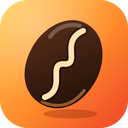
  &nbsp;&nbsp;&nbsp;
  
</p>

# focusbrew

Um tracker do dia pra quem programa, num widget colado no topo da tela. Você
planeja as tarefas de cada dia, dá play em uma, e uma linha se enche em volta
do widget enquanto o tempo corre. No fim do dia, o painel responde **o que você
fez, quanto tempo levou e em qual projeto** — e o que já está planejado pra
amanhã.

Feito com [Tauri](https://tauri.app) (Rust) + React/TypeScript. Windows.

<p align="center">
  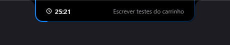
</p>

## Como funciona

- **Parado:** uma barra reta e fina no topo da tela, sem nada dentro.
- **Rodando:** a barra vira uma caixa com a contagem regressiva e o nome da
  tarefa; uma linha em volta vai se enchendo. No modo **Minimal** só a caixa e a
  linha aparecem.
- **Passou o mouse:** o painel abre. Quando o mouse sai, ele fecha.
- **Clicou na barra:** o painel abre **fixado** — fica aberto até você apertar
  `Esc` ou clicar fora. Bom pra planejar com calma.

A barra, a caixa e o painel são uma forma só que se transforma; a janela nunca
muda de tamanho, então nada pisca nem trava. Fora da forma, o mouse passa direto
pro que está embaixo.

Dá pra colar o widget em outra borda: em **Configurações → Notch → Posição**,
escolha Topo, Esquerda ou Direita. Nas laterais a barra fica em pé, centralizada
na altura da tela, e a caixa e o painel saem da borda pra dentro da tela.

<p align="center">
  
  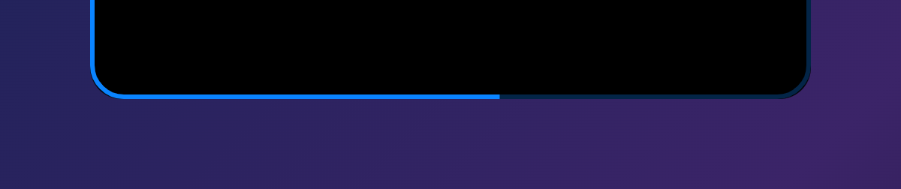
  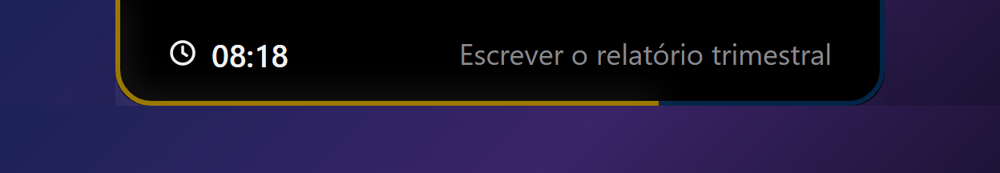
</p>

## O painel

<p align="center">
  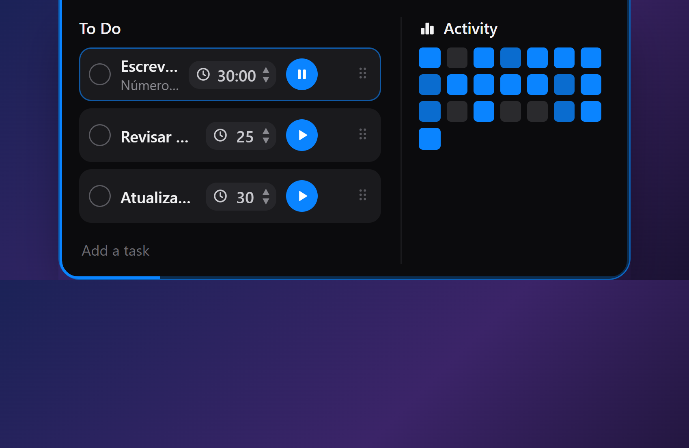
</p>

**Cabeçalho:** `‹ ›` andam pelos dias, o nome do dia ("Hoje", "Amanhã", "qui
08/10") volta pra hoje, e à direita aparece o foco do dia (e a meta, se tiver)
e quantas tarefas foram concluídas.

### Tarefas

- Cada tarefa tem o **seu tempo** (5 a 180 min), um botão **play**, e uma alça
  pra **arrastar** e reordenar. Passando o mouse aparecem **→** (mover pro dia
  seguinte) e **×** (remover).
- **Cada dia tem a sua lista.** Escreva no campo de baixo pra criar no dia que
  está aberto. Tarefa que ficou pra trás aparece em hoje com "de 02/10" — nada
  se perde.
- **Arraste uma tarefa até um quadrado da Activity** pra planejar pra aquele
  dia.
- **Projeto:** termine o texto com `#projeto` ("Corrigir login #virex").
  **Duplo clique** no título edita (`Enter` salva, `Esc` cancela).
- Só uma tarefa roda por vez. Trocar, parar, concluir ou fechar o app guardam o
  tempo trabalhado. Quando o tempo acaba, o Windows avisa; quem marca como feita
  é você. Computador dormindo não conta.

### Resumo do dia

<p align="center">
  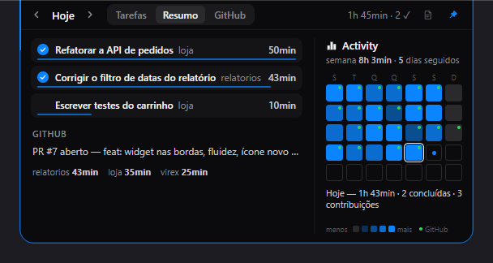
</p>

Tudo que você fez no dia: tempo por tarefa (com barrinha), o que foi concluído,
o que aconteceu no GitHub (commits, PRs, reviews) e o total por projeto. Dias
que já passaram mostram só o resumo.

### Activity

Cinco semanas: as três anteriores, a atual e a **próxima** (pra planejar).
Quanto mais foco, mais forte o azul; o ponto verde marca dias com contribuição
no GitHub; o ponto azul num dia futuro marca tarefa planejada. **Clique num
quadrado** pra abrir aquele dia. Em cima, o total da semana e a sequência de
dias seguidos com foco; embaixo, a descrição do dia sob o mouse.

### GitHub

<p align="center">
  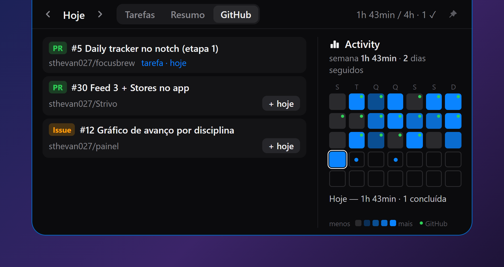
</p>

Os PRs e issues abertos que envolvem você. **+ hoje** (ou o dia aberto) cria a
tarefa com o link e o repositório como projeto. Um PR que **já é tarefa** mostra
pra qual dia está planejado ("tarefa · amanhã") e oferece trazer pro dia aberto,
em vez de duplicar.

<p align="center">
  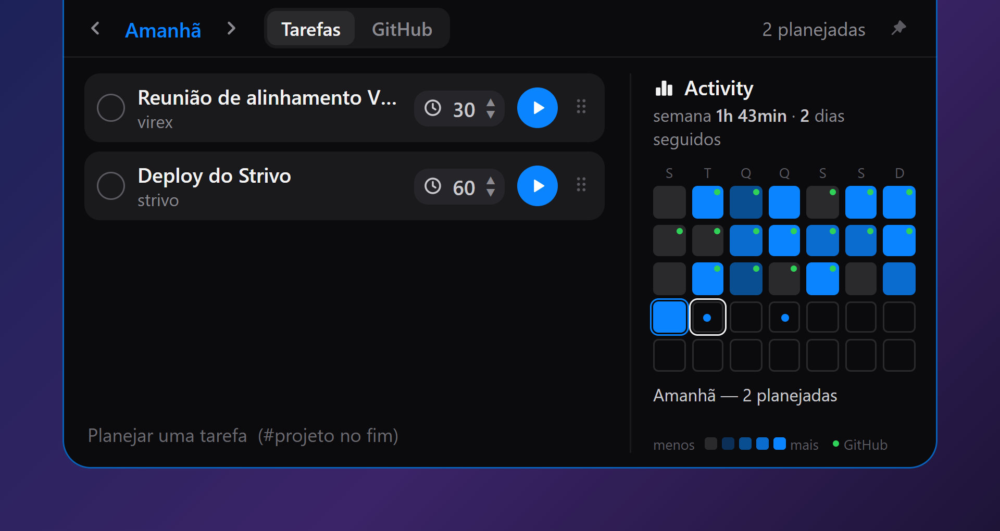
</p>

## Atalhos

| Atalho (padrão) | O que faz |
|---|---|
| `Ctrl+Shift+Space` | pausa/retoma o bloco; parado, inicia a primeira tarefa de hoje |
| `Ctrl+Shift+Alt+Space` | abre/fecha o painel fixado |

Os dois mudam em **Configurações → Geral** (clique e aperte a combinação). Se
outro programa já usa uma combinação, o focusbrew avisa qual e o outro atalho
continua funcionando.

## Configurações

Clique no ícone da bandeja (ou **Abrir configurações** no menu dele).

<p align="center">
  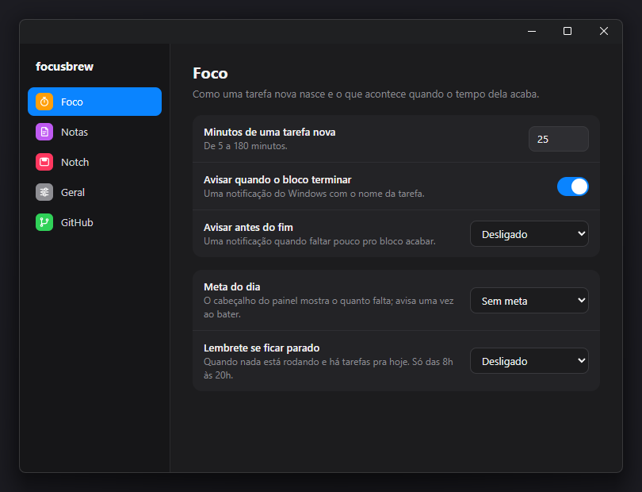
</p>

| Seção | O que muda |
|---|---|
| **Foco** | minutos de uma tarefa nova; aviso no fim do bloco e **antes do fim**; **meta do dia**; **lembrete se ficar parado** (só das 8h às 20h) |
| **Projetos** | tempo por projeto: hoje, 7 dias, 30 dias e total |
| **Notch** | estilo Standard ou Minimal; linha de progresso; linha RGB; cor de destaque; tamanho |
| **Geral** | mostrar o widget; **monitor** do widget; **iniciar com o Windows**; os atalhos |
| **GitHub** | conectar pelo login do `gh` (ou um token) |

<p align="center">
  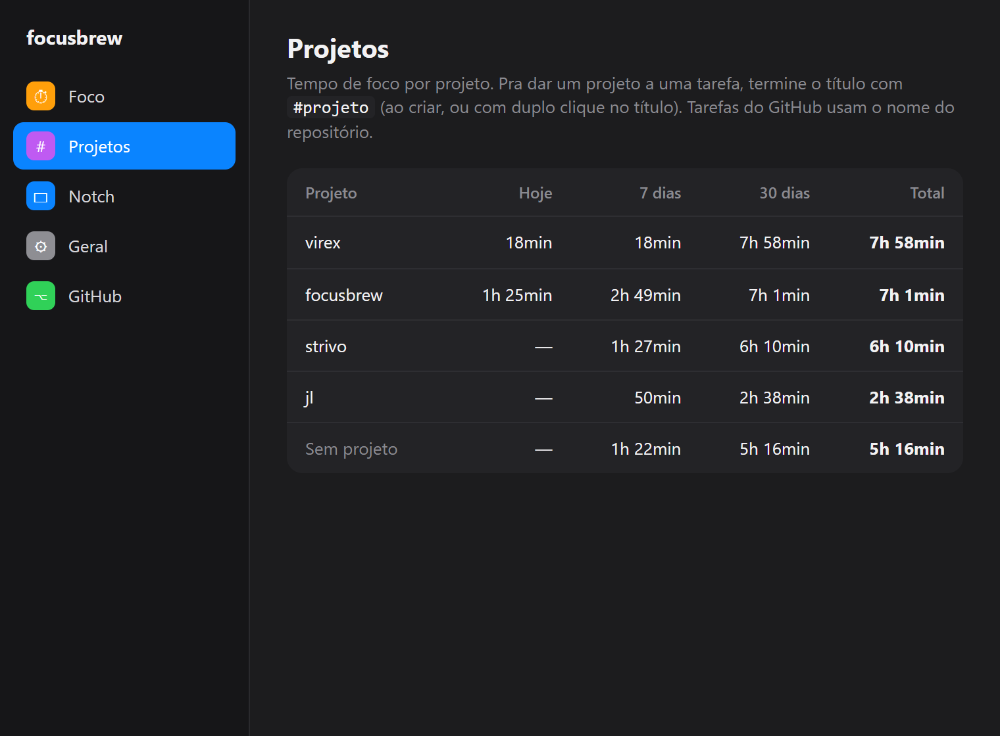
  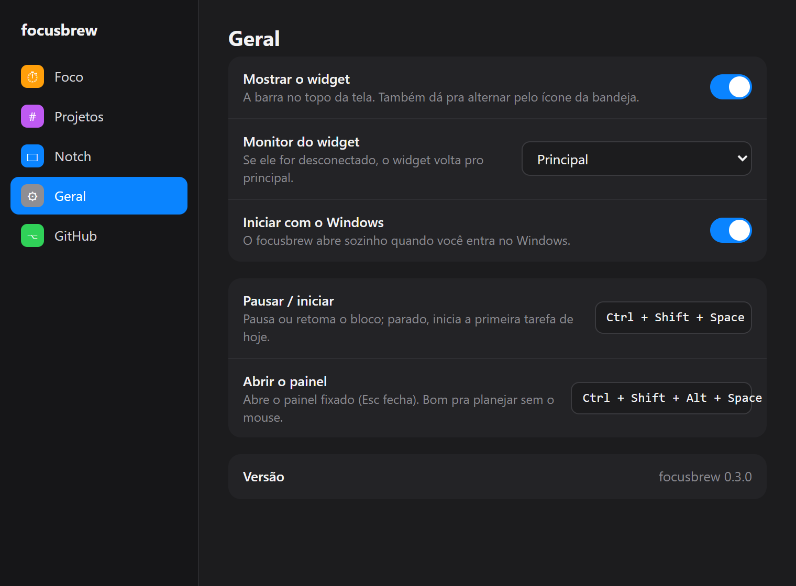
</p>

### Conectar o GitHub

Se o [GitHub CLI](https://cli.github.com) estiver instalado e logado
(`gh auth login`), a aba GitHub mostra **Conectar com o GitHub CLI**, sem token
pra colar. Sem o `gh`, dá pra usar um Personal Access Token (guardado no cofre
de credenciais do Windows). PRs, issues, contribuições e a sua atividade
atualizam ao abrir o app e a cada 5 minutos.

## Instalação

Baixe o instalador mais recente em
[Releases](https://github.com/sthevan027/focusbrew/releases)
(`focusbrew_<versão>_x64-setup.exe`).

O instalador é de **um clique**: instala só pro usuário atual (sem pedir
admin), sem telas de assistente, cria atalhos na área de trabalho e no menu
Iniciar e abre o app ao terminar.

Se o SmartScreen avisar na primeira execução (o certificado é interno),
clique em **Mais informações → Executar assim mesmo**.

Pra desinstalar: **Configurações → Apps → Apps instalados → focusbrew**.

## Desenvolvimento

Pré-requisitos: [Rust](https://www.rust-lang.org/tools/install) + o Visual
Studio Build Tools com o workload "Desktop development with C++" (veja os
[pré-requisitos do Tauri](https://tauri.app/start/prerequisites/)) e Node.js 18+.

```bash
npm install
npm run tauri dev      # app em desenvolvimento
npm test               # contas do front-end (vitest)
cargo test --manifest-path src-tauri/Cargo.toml   # regras do timer, tarefas, alertas e configurações
npm run dist            # instalador em src-tauri/target/release/bundle/nsis/
npm run dist:signed     # o mesmo, assinado (certificado em src-tauri/tauri.signing.conf.json)
```

O instalador usa uma cópia do template NSIS do Tauri
(`src-tauri/windows/installer.nsi`, base `tauri-cli` 2.11.4) que força o modo
passivo; se atualizar o `@tauri-apps/cli`, compare com o template novo.

### Como o código está organizado

```
src-tauri/src/
  tracker/        o coração, sem Tauri: timer por horário final, tarefas por dia,
                  histórico de blocos e tempo por projeto
  alerts.rs       aviso antes do fim, meta do dia, lembrete de parado (puro)
  shortcuts.rs    os dois atalhos globais, cada um registrado por conta própria
  autostart.rs    iniciar com o Windows (chave Run do usuário)
  widget.rs       janela do widget: tamanho fixo, colada no topo, mouse atravessando
  config.rs       configurações (lê qualquer arquivo, antigo ou quebrado, sem falhar)
  state.rs        o estado e o que a interface recebe
  commands.rs     os comandos que a interface chama
  github.rs       login pelo gh/token, PRs e issues, contribuições, atividade
  lib.rs          bandeja, atalhos, o relógio de 1 s, notificações
src/
  Widget.tsx      a janela do widget (a forma que vira barra, caixa ou painel)
  widget/         Panel, TaskList, TaskRow, DaySummaryView, ActivityPanel, GithubTab
  App.tsx         a janela de configurações
  settings/       as seções
  lib/            contas puras (dias, resumo, grade, GitHub, atalhos) com testes
```

O backend guarda *qual tarefa está rodando* e *quando ela termina*; a interface
só desenha a partir desse horário, sem contar tempo por conta própria. Os
dados ficam em `%APPDATA%\sthevandev\focusbrew\` (`config\settings.json`,
`data\tasks.json`, `data\activity.json` — este com o histórico de blocos dos
últimos 400 dias).

## Licença

MIT.
